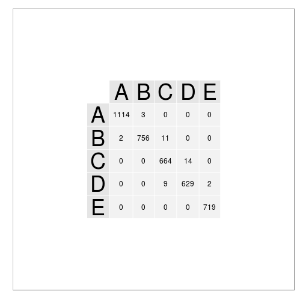

Predicting the Quality of Weight Lifting Exercises
========================================================

# Introduction

Most of the time, when we talk about exercises, we can only care about the time. However, with the help of devices such as _Jawbone Up_, _Nike FuelBand_, and _Fitbit_, we may monitor the quality of some exercises, for example, weight lifting. In this work, we try to use radomforest to build a prediction model to connect the data from the devices with the quality of weight lifting.

# Explore the data


```r
library(caret)
```

```
## Loading required package: lattice
## Loading required package: ggplot2
```

```r
testdata <- read.csv('pml-testing.csv')
traindata <- read.csv('pml-training.csv')
# subset the data to get related variables
varindex <- grep("belt|forearm|arm|dumbell",colnames(traindata))
SubData <- traindata[,varindex]
responds <- traindata$classe
# remove the near zero variables
zeroindex <- nearZeroVar(SubData)
Subsubdata <- SubData[,-zeroindex]
# remove the column with NA
final <- Subsubdata[,!apply(Subsubdata,2,function(x) any(is.na(x)))]
# combine the predictor with the outcome
final <- cbind(final,responds)
```

First, I read in the data and choose the related variables with belt, forearm, arm, and dumbell in the variables names. These variables may stand for some  accelerators data which may describe a behavior. Then I remove the variables with little variation and NA values and combine it to the classes from the last column of the train data set. Also those process need to be applied on the test data set. The final data have 19622 observations with 39 variables. 

The variables are mainly about the sensors on the devices, the outcome are factor variables with name 'A', 'B', 'C', 'D', 'E', in which for class A corresponds to the specified execution of the exercise, while the other 4 classes correspond to common mistakes.

# Model selection

I divided the final data into 60% for train data, 20% for test data and 20% for validation data. On the train data, I decided to make a 5-fold cross-validation and repeat 10 times to get a model. For limited CPU, I sampled 2000 observation and try to train different models such as randomforest, support vector machine, linear discriminant analysis and to make a model selection.For the support vector machine, I use a radial basis function as Kernel for their better performance in classification from my personal experiences.


```r
# divided the data into train and test 
train <- createDataPartition(y=final$responds,p=0.60, list=FALSE)
trains <- final[train,]; testsall <- final[-train,]
testid <- createDataPartition(y=testsall$responds,p=0.50, list=FALSE)
tests <- testsall[testid,];validation <- testsall[-testid,]
# make a 5-fold cross-validation with 10 repeats
tc <- trainControl(method = "cv", number = 5, repeats = 10)
# sub set the data
set.seed(42)
st <- trains[sample.int(nrow(trains),2000),]
modrf <- train(responds ~.,method="rf",data=st,trControl=tc)
modsvm <- train(responds ~.,method="svmRadial",data=st,trControl=tc)
modlda <- train(responds ~.,method="lda",data=st,trControl=tc)

predrf <- predict(modrf,tests)
predsvm <- predict(modsvm,tests)
predlda <- predict(modlda,tests)

resultrf <- confusionMatrix(predrf, tests$responds)
resultsvm <- confusionMatrix(predsvm, tests$responds)
resultlda <- confusionMatrix(predlda, tests$responds)
```

Each model were trained with parameter(except for linear discriminant analysis). From the result, the randomforest show an accuracy of 0.9404  with a tuned `mtry` of 20; the support vector machine show an accuracy of 0.7076 with a tuned `sigma` of 0.0168 and `C` of 1; the linear discriminant analysis show an accuracy of 0.5575. So I choose the ranfomforest as my final model and train it with the train data.


```r
# predict with randomforest
modfinal <- train(responds ~.,method="rf",data=trains,trControl=tc)
pred <- predict(modfinal,tests)
result <- confusionMatrix(pred, tests$responds)
```

The final model get an overall accuracy 98.88% on the test data set. The 5-fold cross-validation were used to tune `mtry`, which means the variables used to build a tree. If the `mtry` is large, it will perform just like bagging without an enough decrease of the model variance. However, small `mtry` means a biased model. The final model with a `mtry` of 20 from the cross-validation result. 

# Final prediction


```r
predfinal <- predict(modfinal,validation)
finalresult <- confusionMatrix(predfinal, validation$responds)
library(gridExtra)
qplot(0,0, geom = "blank") + 
    theme_bw() +
    theme(line = element_blank(),
          text = element_blank()) +
    annotation_custom(grob = tableGrob(finalresult$table,
                                       # change font sizes:
                                       gpar.coltext = gpar(cex = 3),
                                       gpar.rowtext = gpar(cex = 3)),
                      )
```

 

Here I used the left validation data set to estimate the out of sample error. The out of sample error is 0.011. So I think with the 5-fold cross-validation to tune the `mtry`, the error rate in the model could satisfy the qualitative activity recognition of weight lifting exercises. The final prediction result is in the figure above.

# Reference

Velloso, E.; Bulling, A.; Gellersen, H.; Ugulino, W.; Fuks, H. Qualitative Activity Recognition of Weight Lifting Exercises. Proceedings of 4th International Conference in Cooperation with SIGCHI (Augmented Human '13) . Stuttgart, Germany: ACM SIGCHI, 2013.
